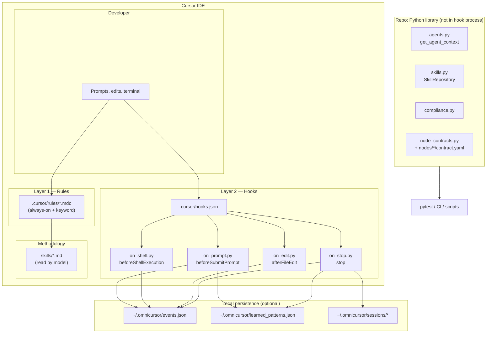
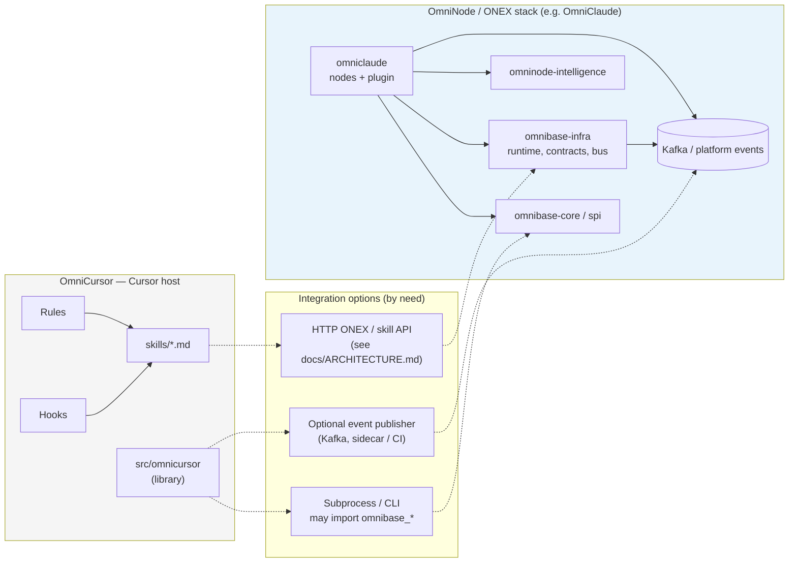

# OmniCursor — systems design

High-level architecture diagrams for OmniCursor and its optional relationship to the broader OmniNode stack (OmniClaude-style runtimes). Mermaid renders on GitHub and many other viewers.

---

## 1. OmniCursor — runtime layers (inside the IDE)



**Constraints:** Hook scripts under `.cursor/hooks/` use **stdlib only** and **must not** import `omnicursor`. The library under `src/omnicursor/` is for **tests**, **CI**, **optional CLIs**, or **subprocess** helpers invoked from outside the hook interpreter.

---

## 2. OmniCursor in the broader OmniNode ecosystem

Optional ways to align with OmniClaude / ONEX without running the full kernel inside Cursor:



Solid arrows: primary OmniCursor flows. Dotted arrows: **optional** integration paths.

---

## 3. Intelligence layer — local pattern learning (Option A)

The pattern learning loop runs entirely in hooks using stdlib only. No external services required.

```
on_prompt.py (beforeSubmitPrompt)
  └── pattern_loader.py reads ~/.omnicursor/learned_patterns.json
  └── injects top-5 most relevant patterns into system message

on_stop.py (stop)
  └── derive_session_outcome() → "success" / "failed" / "abandoned" / "unknown"
  └── on "success": pattern_writer.write_session_patterns(events, outcome)
        ├── extracts prompt_classified events to identify injected patterns
        ├── upserts each domain pattern with weight increment
        │     └── if pattern was injected this session: weight × 1.5 multiplier
        │         (injection_count += 1, utilization_successes += 1)
        ├── evicts low-utility patterns: injection_count > 10 AND success_rate < 0.2
        └── evicts overflow: keeps at most 20 patterns per domain (lowest weight removed)
```

### Pattern record schema

Each entry in `~/.omnicursor/learned_patterns.json`:

| Field | Type | Description |
|-------|------|-------------|
| `key` | string | Sorted keyword fingerprint (e.g. `"debug fix test TypeError"`) |
| `domain` | string | Agent category (`debugging`, `brainstorming`, etc.) |
| `weight` | float | Relevance score; decays over time, boosted on successful sessions |
| `success_count` | int | Sessions where outcome was `success` |
| `injection_count` | int | Times this pattern was injected into a prompt |
| `utilization_successes` | int | Times injected AND session outcome was `success` |
| `last_seen` | ISO timestamp | Last time this pattern was written |
| `description` | string | `"Auto-learned: <60-char prompt snippet> → <agent> (score X.XX)"` |

### Honest tradeoff

The utilization signal is `session_outcome == success AND pattern_was_injected`. That is **correlation, not utilization** — it cannot determine whether the AI's response actually referenced the injected pattern. A pattern that gets injected on every session and is always ignored will still accumulate `utilization_successes` if those sessions happen to end in success.

This closes the "no signal at all" gap. The full gap (verified LLM utilization) requires an LLM check of whether the response referenced the pattern text, which is scoped under Option B as a sub-task of the quality-scoring-compute node.

---

## 4. Intelligence layer — HTTP read sync (Option B)

Option B adds an optional read path from the local intelligence-reducer. All pattern writes still stay local.

```
on_stop.py (stop) — only when OMNICURSOR_PATTERN_SYNC_HTTP=1
  └── pattern_sync.sync_learned_patterns(~/.omnicursor/learned_patterns.json)
        ├── GET http://127.0.0.1:18091/api/v1/patterns  (OMNIINTELLIGENCE_URL overrides base)
        ├── merges remote patterns into local file — local patterns take priority
        │     └── de-duplication by pattern_id, then by JSON fingerprint
        ├── writes merged result back to learned_patterns.json
        └── on any network/HTTP error: returns False, local file unchanged (offline fallback)
```

**What this enables:** patterns seeded or updated by the intelligence-reducer (Postgres-backed) are pulled into the local cache on session end, so the next session's prompt injection benefits from them.

**What this does not do:** local patterns are never sent to the reducer. The write path (stop hook → Postgres) requires Kafka and is scoped to Option C / year-2.

**Prerequisites:** `docker compose up` with the compose stack in this repo. `OMNICURSOR_PATTERN_SYNC_HTTP=1` must be set in the environment (see `.env.omninode.example`). Overrideable base URL: `OMNIINTELLIGENCE_URL=http://127.0.0.1:18091`.

---

## Related docs

- [`ADR-hook-first-architecture.md`](./ADR-hook-first-architecture.md) — rules vs hooks vs library
- [`OMNICURSOR_NODE_CONTRACTS.md`](./OMNICURSOR_NODE_CONTRACTS.md) — `contract.yaml` layout
- [`../ARCHITECTURE.md`](../ARCHITECTURE.md) — starter-pack buckets and frozen HTTP adapter
- [`../QUICKSTART.md`](../QUICKSTART.md) — setup and end-to-end usage
