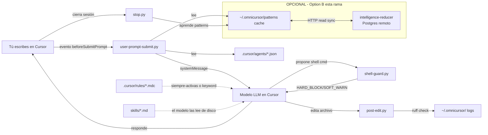

# OmniCursor — Explicación Sencilla del Proyecto

> **Fecha:** 2026-05-09
> **Rama activa:** `julian/omnicursor-optionB`
> **TL;DR:** OmniCursor es un "plugin" para el IDE **Cursor** que le añade reglas de comportamiento, hooks deterministas (Python) y skills en Markdown. No es un servidor ni una app — es código que Cursor carga y ejecuta localmente cuando tú escribes prompts, corres comandos o editas archivos.

---

## 1. ¿Qué es OmniCursor en una frase?

Una **capa de inteligencia local para Cursor IDE** que:

1. **Guía al modelo** con skills (Markdown) + rules (`.mdc`).
2. **Intercepta eventos del IDE** (prompt, shell, edit, stop) con hooks Python deterministas.
3. **Aprende patrones** por sesión y opcionalmente los sincroniza vía HTTP (eso es "Option B" — lo que esta rama está construyendo).

No hay frontend propio. No hay backend siempre-encendido. **El "frontend" es Cursor**; el "backend" son scripts Python que Cursor invoca.

---

## 2. Stack técnico

| Capa | Tecnología |
|---|---|
| Lenguaje principal | Python 3.10+ (stdlib en hooks, sin LLM) |
| Librería de tests/CI | Pydantic v2, PyYAML, Pytest, Ruff |
| Rules & Skills | Markdown (`.mdc` y `.md`) |
| Configs de agentes | JSON (17 archivos en `.cursor/agents/`) |
| Instalador | Bash (`install.sh`, symlinks) |
| Orquestación externa (opcional) | `omnimarket/` con `uv` — registro ONEX con ~135 nodos |

---

## 3. Estructura del repo (lo que importa)

```text
OmniCursor/
├── .cursor/                   ← integración con el IDE Cursor
│   ├── hooks.json             ← mapea eventos de Cursor → scripts Python
│   ├── hooks/
│   │   ├── scripts/           ← hooks ACTIVOS (los que ejecuta Cursor)
│   │   │   ├── user-prompt-submit.py
│   │   │   ├── shell-guard.py
│   │   │   ├── post-edit.py
│   │   │   └── stop.py
│   │   ├── lib/               ← helpers compartidos (_common, pattern_loader,
│   │   │                         agent_scoring, emit_client)
│   │   └── on_*.py            ← shims/legacy compatibles con el README
│   ├── rules/  (13 .mdc)      ← reglas que Cursor aplica al modelo
│   └── agents/ (17 .json)     ← patrones de activación por agente
│
├── skills/  (16 .md + README) ← metodologías que el modelo lee desde disco
│                                 (plan-ticket, pr-review, systematic-debugging…)
│
├── src/omnicursor/            ← librería Python (importable en tests/CI)
│   ├── agents.py              ← scoring de 3 estrategias (HARD_FLOOR = 0.55)
│   ├── skills.py              ← SkillRepository (carga skills/*.md)
│   └── compliance.py          ← checks de keywords por skill
│
├── omnimarket/                ← paquete ONEX portable (~135 nodos, opcional)
├── omniclaude-main/           ← referencia read-only de OmniClaude
├── docs/                      ← QUICKSTART, ARCHITECTURE, HANDOFF, system design
├── tests/                     ← pytest
├── .githooks/pre-commit       ← corre ruff + pytest + compliance antes de commit
├── install.sh                 ← symlinkea el plugin en tu proyecto target
└── pyproject.toml
```

---

## 4. Los 4 hooks (el "wire-up" real)

`.cursor/hooks.json` es el contrato con Cursor. Cuando ocurre un evento del IDE, Cursor ejecuta el script correspondiente:

| Evento de Cursor | Script que corre | Qué hace |
|---|---|---|
| `beforeSubmitPrompt` | `scripts/user-prompt-submit.py` | Puntúa al usuario contra los 17 agentes, inyecta el agente ganador + patterns aprendidos como `systemMessage` |
| `beforeShellExecution` | `scripts/shell-guard.py` | Guard de 2 niveles: **HARD_BLOCK** (deniega) o **SOFT_WARN** (permite + avisa) |
| `afterFileEdit` | `scripts/post-edit.py` | Loggea el edit, corre `ruff check` diagnóstico en archivos `.py` |
| `stop` | `scripts/stop.py` | Clasifica el outcome de la sesión (4-gate) y aprende patrones |

**Clave:** los hooks son **stdlib only**, sin LLM, sin red obligatoria → deterministas y rápidos.

---

## 5. ¿Cómo se conecta todo? (mental model)



**Flujo de datos resumido:**

1. **Entrada:** tu prompt → Cursor → `user-prompt-submit.py` puntúa y enriquece.
2. **Guidance:** rules + skills guían al modelo (no son ejecutables, son texto que el modelo lee).
3. **Ejecución:** modelo propone shell/edit → hooks `shell-guard` / `post-edit` filtran y loggean.
4. **Aprendizaje:** al terminar, `stop.py` clasifica y guarda patterns en `~/.omnicursor/`.
5. **Sync (Option B, esta rama):** cache local ↔ backend HTTP Postgres para seed de patterns (read-only por ahora).

---

## 6. ¿Cómo correr el proyecto?

### Primer setup (una sola vez)

```bash
# 1. Clonar a ubicación permanente
git clone https://github.com/OmniNode-ai/OmniCursor ~/tools/OmniCursor
cd ~/tools/OmniCursor

# 2. Instalar la librería en un venv
python3 -m venv .venv && source .venv/bin/activate
pip install -e ".[dev]"

# 3. Habilitar el pre-commit gate tracked
git config core.hooksPath .githooks
chmod +x .githooks/pre-commit
```

### Instalar OmniCursor en un proyecto target

```bash
./install.sh /ruta/a/tu-proyecto           # instala (symlinks)
./install.sh /ruta/a/tu-proyecto --status  # ver estado
./install.sh /ruta/a/tu-proyecto --uninstall
./install.sh /ruta/a/tu-proyecto --dry-run
```

> Los symlinks apuntan de vuelta a `~/tools/OmniCursor`. Actualizar OmniCursor actualiza todos los proyectos instalados.

Luego abres el proyecto en **Cursor** y los hooks + rules se activan automáticamente.

### Correr tests y lint (lo mismo que corre CI)

```bash
pytest tests/ -v
ruff check src/ tests/ .cursor/hooks/
```

### Omnimarket (opcional, el registro ONEX)

```bash
uv run pytest omnimarket/tests/
```

---

## 7. ¿Dónde vive el estado?

- **Local por usuario:** `~/.omnicursor/` (eventos, patterns aprendidos, logs de sesión).
- **Config por proyecto:** `.cursor/` del proyecto target (todos symlinks hacia este repo).
- **Config opcional:** `.env.omninode.example` → copia a `.env` si quieres activar sync HTTP (`OMNICURSOR_PATTERN_SYNC_HTTP`).

---

## 8. Estado actual (rama `julian/omnicursor-optionB`)

Esta rama está construyendo **"Option B" de la capa de inteligencia**:

- ✅ Hooks deterministas estables (4 eventos cableados en `hooks.json`).
- ✅ 13 rules + 16 skills + 17 agent configs en producción.
- ✅ `src/omnicursor/` importable para tests y CI.
- 🚧 **En progreso:** sincronización **read-only HTTP** desde un `intelligence-reducer` remoto (Postgres) hacia el cache local de patterns. Las escrituras siguen siendo locales.
- 📦 `omnimarket/` disponible como paquete paralelo (~135 nodos ONEX contract-backed) para workflows externos.

---

## 9. Archivos clave para leer primero

| Si quieres entender… | Lee |
|---|---|
| El repo en alto nivel | `README.md` |
| Cómo se cablean los hooks | `.cursor/hooks.json` + `.cursor/hooks/scripts/*.py` |
| La arquitectura completa | `docs/ARCHITECTURE.md` |
| Diagramas del runtime | `docs/dev/OMNICURSOR_SYSTEM_DESIGN.md` |
| Estado de implementación | `docs/archive/dev/HANDOFF.md` |
| Cómo arrancar hoy | `docs/QUICKSTART.md` |
| Criterios de "done" | `OmniCursor_DoD_Rubric.md` |

---

## 10. Resumen de 30 segundos

> OmniCursor = **plugin local para Cursor IDE**. 4 hooks Python se enganchan a eventos del IDE (`prompt`, `shell`, `edit`, `stop`), usan rules + skills en Markdown para guiar al modelo, y guardan patrones aprendidos en `~/.omnicursor/`. Se instala con `./install.sh <proyecto>` (symlinks). La rama actual añade sync HTTP read-only de patterns contra un backend Postgres. Tests corren con `pytest tests/` y pasan por el pre-commit gate en `.githooks/pre-commit` antes de cualquier commit.
